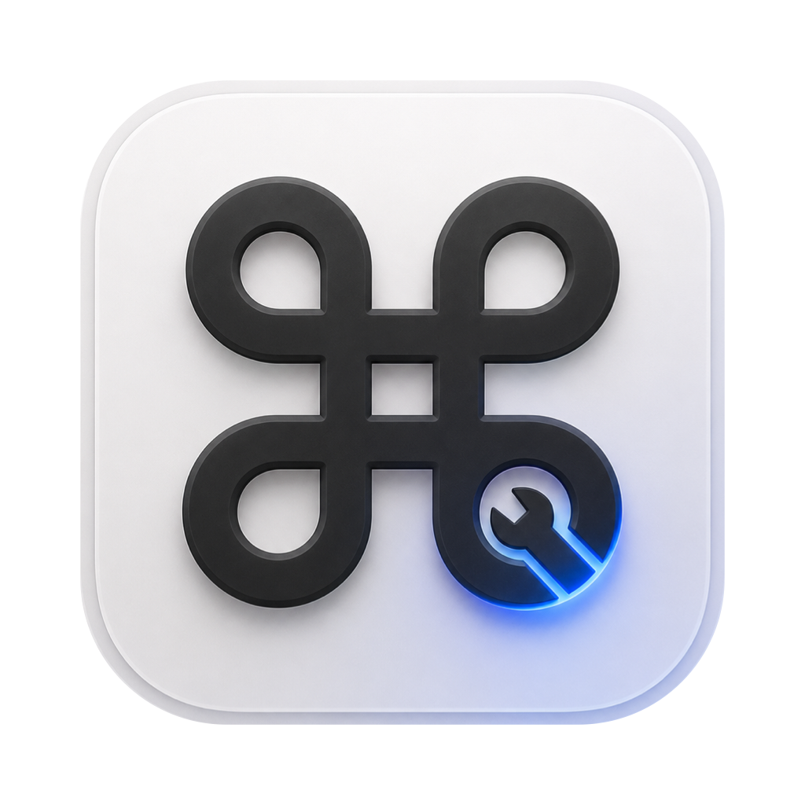
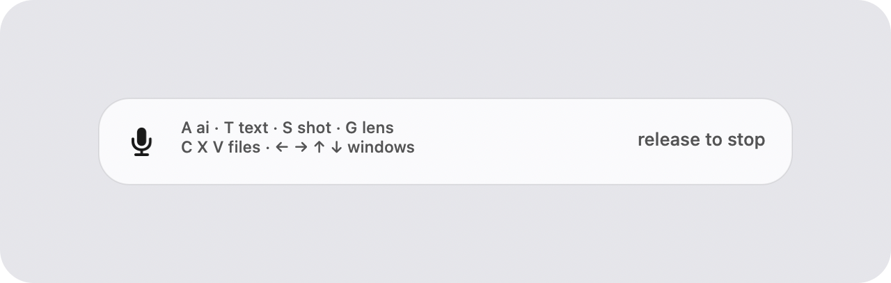
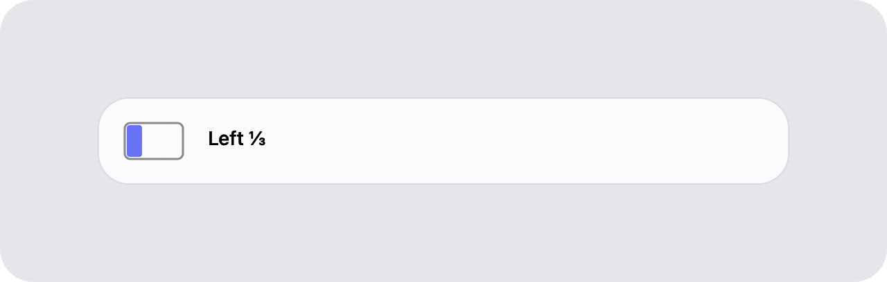
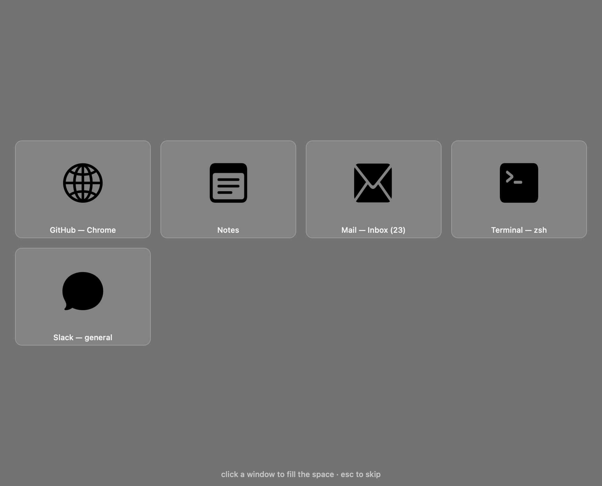
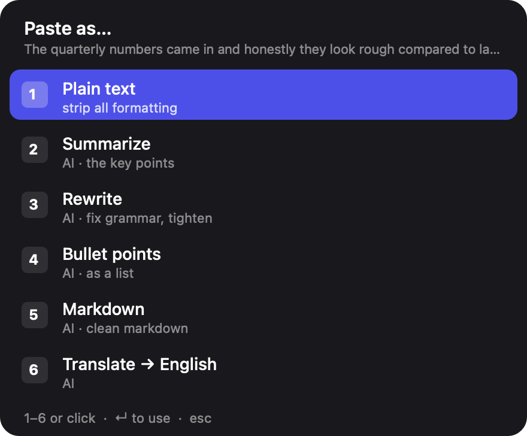
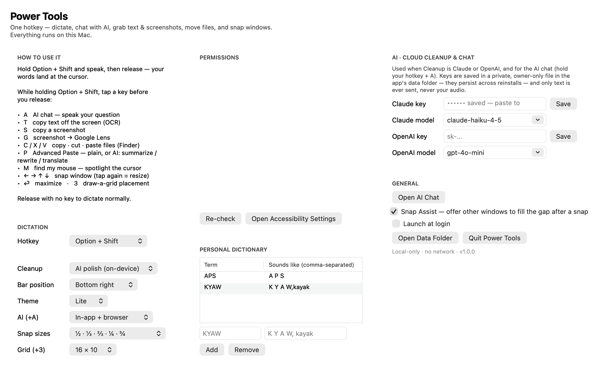

<p align="center"></p>

# Power Tools

> **The PowerToys of macOS.** One hotkey, a whole toolbox — and the core tools never leave your Mac.
>
> **Website: [powertools.geeksare.cool](https://powertools.geeksare.cool)** · [Download the latest DMG](https://github.com/BadassHomesteader/grc-power-tools/releases/latest/download/Power-Tools.dmg)

Power Tools puts a suite of power-user utilities behind a single hotkey. **Hold Option + Shift**, then speak or tap a letter/arrow: dictate into any app, open a Claude chat, snap and tile windows, OCR the screen, grab a screenshot, cut & paste files, transform your clipboard, or spotlight your cursor. If you've missed Windows PowerToys on the Mac, this is that — FancyZones-style snapping, Advanced Paste, Text Extractor, and Find My Mouse — plus on-device dictation and AI chat.

**In the box:** 🎙 Dictation · 💬 AI chat · 🔀 ⌘Tab like Windows Alt-Tab · 🪟 Window snapping + Snap Assist · 🎛 Snap palette (Moom-style) · 🗔 Saved layouts · ▦ Grid placement · 📋 Clipboard history (Win+V-style, text + images) · ⚡ Quick Capture → your own endpoints · 🔤 OCR (Text Extractor) · 📸 Screenshots · 🔎 Google Lens · 🗂 File cut/paste · 📝 Advanced Paste · 🖱 Find My Mouse · 🔇 Call-safe dictation

**The app bundle and data folder are still named `GRC Whisper` / bundle ID `com.grc.whisper`** so macOS permissions and saved keys survive the rename.

**The core tools run entirely on this Mac.** Dictation is on-device by default — speech recognition is Apple's on-device `SpeechAnalyzer` (macOS 26), text cleanup is Apple's on-device Foundation Model, and history lives in a local SQLite file. The only network calls are the *opt-in* AI features — AI chat, cloud cleanup, and Advanced Paste's smart transforms — and only when you invoke them, with your own API key. Little-Snitch-clean by design.

## Screenshots

<p align="center"></p>
<p align="center"><em>Hold your hotkey and talk — mic, a live waveform, and “release to stop.” Let go and polished text lands in whatever app has focus.</em></p>

<table>
<tr>
<td width="50%" valign="top"><br><b>Window snapping</b> — hold + arrows to snap a window to a side; tap again to cycle ½ · ⅓ · ⅔.</td>
<td width="50%" valign="top"><br><b>Snap Assist</b> — right after a snap, pick another window to fill the empty half (like Windows).</td>
</tr>
<tr>
<td width="50%" valign="top"><br><b>Advanced Paste</b> — hold + P for plain text, summarize, rewrite, bullets, markdown, or translate.</td>
<td width="50%" valign="top"><br><b>Settings</b> — choose your hotkey, light/dark theme, snap sizes, grid, and AI-chat mode.</td>
</tr>
</table>

## How it works

```
hold ⌥⇧ ──► mic (always-warm, 1s pre-roll) ──► SpeechAnalyzer (streams while you speak)
release ──► finalize (~0.2-0.6s) ──► Tier-0 cleanup (dictionary + fillers)
       ──► on-device LLM polish (deadline-guarded, falls back to Tier-0)
       ──► clipboard-swap paste into the focused app (your clipboard is restored)
```

- **Hold Option + Shift** (either side — it's ambidextrous) to talk, release to insert. **Esc** cancels. This one hotkey is also a *leader*: hold it and tap a letter or arrow for a different tool (see [Leader chords](#leader-chords-hold-your-hotkey-tap-a-letter) below) instead of speaking. Configurable in Settings (Fn, Right Option, Control+Option, etc.).
- Live partial transcript shows in a bottom-center overlay that never steals focus.
- The polish pass removes fillers (um/uh), applies self-corrections ("meet Tuesday — scratch that, Wednesday" → Wednesday only), fixes punctuation, and respects your personal dictionary. If the LLM is slow or unavailable, you get the deterministic Tier-0 cleanup instead — never nothing.
- Raw + polished text for every dictation is kept in local history (menu bar ▸ Recent).

## Build & install

Requires macOS 26+ (Apple Silicon) and Command Line Tools. No Xcode, no dependencies.

```bash
scripts/bundle.sh --install    # builds, signs, copies to /Applications
open "/Applications/Power Tools.app"
```

> `Package.swift` exists for SwiftPM-capable toolchains, but `scripts/bundle.sh`
> compiles with `swiftc` directly — the CLT-only SwiftPM on this machine has a
> broken PackageDescription dylib.

## First-run setup (one time)

TCC permissions attach to the app bundle's ID + signature, which `scripts/bundle.sh` keeps stable across rebuilds. Grant these when prompted (or pre-emptively in System Settings ▸ Privacy & Security):

1. **Microphone** — prompted on first launch.
2. **Accessibility** — required for the global hotkey tap and the paste keystroke. The app prompts; toggle **GRC Whisper** on.
3. **Input Monitoring** — macOS sometimes also requires this for the keyboard listener; grant it if it appears.
4. **Only if you switch the hotkey to Fn/Globe:** System Settings ▸ Keyboard ▸ "Press 🌐 key" → "Do Nothing", otherwise macOS opens emoji/dictation on the Fn key and fights the hotkey. The default **Option + Shift** hotkey needs no such remap and works on external keyboards too.

Then verify with the menu bar ▸ **Permission Doctor…**, or:

```bash
"/Applications/Power Tools.app/Contents/MacOS/Power Tools" doctor
```

After a macOS update or if the hotkey dies, re-run the doctor — event taps occasionally need Accessibility re-granted.

**After every rebuild/reinstall**: toggle GRC Whisper **off and on** in the Accessibility list. Ad-hoc signatures pin the build hash, so a rebuilt binary silently loses the grant even though the checkbox still shows enabled.

## CLI

The same binary doubles as a test/administration CLI:

```bash
grc-whisper transcribe file.wav          # engine test (no permissions needed)
grc-whisper polish "um meet Tuesday scratch that Wednesday"
grc-whisper doctor                       # permission / model status
grc-whisper dict add KYAW "K Y A W,kayak"   # term + comma-separated misheard variants
grc-whisper dict list
grc-whisper history 20
```

The personal dictionary does two jobs: deterministic replacement of misheard variants (Tier-0, works even with polish off) and a spelling authority passed to the LLM for phonetically-near matches.

## Configuration

`~/Library/Application Support/GRC Whisper/config.json` (also settable from the menu bar):

| key | default | notes |
|-----|---------|-------|
| `hotkey` | `optionShift` | `optionShift` (default, ambidextrous, any keyboard), `fn`, `rightOption`, `rightCommand`, `ctrlOption`, `shiftCommand`. `fn` isn't delivered by non-Apple keyboards — use `optionShift` or `ctrlOption` there. |
| `polish` | `apple` | `apple` (on-device AI), `claude`/`openai` (cloud, opt-in), `basic` (dictionary+fillers only), `off` (raw) |
| `claudeModel` | `claude-haiku-4-5` | cloud model when `polish: claude` (change to `claude-opus-4-8` for max quality) |
| `openaiModel` | `gpt-4o-mini` | cloud model when `polish: openai` |
| `localeIdentifier` | `en_US` | any of the ~30 SpeechTranscriber locales |
| `llmDeadlineMs` | `2500` | polish deadline; on expiry Tier-0 text is inserted |
| `clipboardRestoreDelayMs` | `600` | how long the transcript stays on the clipboard before restore |
| `maxUtteranceSeconds` | `120` | hard cap per hold |

History, dictionary, and logs live in the same folder. Delete the folder to reset everything.

## Design notes (the sharp edges this app rounds off)

- **First-syllable loss**: the mic engine runs continuously with a 1s pre-roll ring buffer, so audio from *before* key-down is included. On-demand mic startup costs ~500ms and eats the first word (a chronic complaint in this app class).
- **Clipboard safety**: paste is a full-fidelity clipboard swap — all pasteboard item types are snapshotted and restored (images/files survive), the transcript item is marked `org.nspasteboard.ConcealedType` so clipboard managers skip it, and restore only happens if the pasteboard still holds our session UUID (never clobbers something you copied mid-cycle).
- **Event-tap hardening**: exact-match-only suppression, auto re-enable on `tapDisabledByTimeout`, stale-hold expiry, and a 5s health check that revives silently-dead taps (a real macOS 26 failure mode). A stuck key can never eat your spacebar.
- **Secure fields**: dictation into password fields is refused with a visible message (secure input also blocks the tap — nothing would work anyway).
- **LLM guardrails**: the polish output is sanity-checked (length ratio, refusal prefixes) and deadline-raced against Tier-0; the raw transcript is always preserved in history. Dictated text is treated as data — "ignore your instructions…" gets typed, not obeyed.

## Leader chords (hold your hotkey, tap a letter)

Your hotkey doubles as a *leader* — hold **Option + Shift** and the overlay shows the menu (`A ai · T text · S shot · G lens` / `C X V files · W palette · ← → ↑ ↓ win`). Keep holding and tap a key, or just speak. Until you speak, the overlay shows the hint strip; the moment you talk it swaps to the live waveform.

**Text & AI**
- **hold + speak + release** → dictation (as normal).
- **On a Zoom/Teams call?** The speakers auto-mute for exactly as long as you hold the key, then restore — so the meeting audio never bleeds through the mic into your transcript. Toggle in Settings ▸ Dictation.
- **hold + A**, then speak → **AI chat**: what you say opens a streaming Claude chat window. Set the mode in Settings — *native* (in-app window), *browser* (claude.ai tab), or *both* (a native window with a “claude.ai ↗” button).
- **hold + T** → **text (OCR)**: drag a screen region, the recognized text is copied to your clipboard. Tables come back **tab-separated** so they paste into Excel/Sheets/Numbers as a grid. Fully local via Apple Vision.
- **hold + S** → **screenshot**: drag a region, the image is copied to your clipboard.
- **hold + G** → **Google Lens**: drag a region → image to clipboard + Google Lens results open in your browser (Circle-to-Search style).

**Files** (with the Finder frontmost)
- **hold + C** copy the selected files · **hold + X** cut · **hold + V** paste — cut files are *moved* into the front Finder window. A keyboard cut/paste for files, like Windows Explorer.
- **⏎ opens the selection** (Windows-style) instead of starting a rename — works for files and folders; Return still types normally in rename and search fields. Rename via right-click ▸ Rename or a slow double-click. Toggle in Settings ▸ General.
- **Windows-style keys** (Settings ▸ General): **Home / End** jump to line start/end in text fields (⌃ for document top/bottom, ⇧ to select); in Finder, **⌫ Backspace** goes up to the enclosing folder and **⌦ Delete** moves the selection to Trash; **⌃⇧⎋** opens Activity Monitor (the Task Manager reflex). Each key still does its normal job in rename/search fields.
- **New Document in Finder** (Settings ▸ General ▸ *Set up ‘New Document’*): seeds macOS's native right-click "New Document" menu with blank **Word, Excel, Text, RTF, and Markdown** files — the Windows "New ▸" gap. One-time setup; afterward it's Finder's own menu, no Power Tools involvement.

**Windows**
- **hold + ← / → / ↑ / ↓** → snap the focused window to that side/edge. Tap the same arrow again to **cycle sizes** (½ · ⅓ · ⅔ by default; ¼/¾ or ⅕/⅘ selectable in Settings — each set includes the larger complement from the other side).
- **Chain two arrows for a corner** — ← then ↑ lands the **top-left quarter** (Moom-style); the sizes you've cycled on each axis carry into the corner.
- **hold + W** → **snap palette**: a compact panel of targets drawn as mini window diagrams — a halves row (Fill · left/center/right ½ · top/bottom ½; hold **⌥** for corner quarters + center) and a thirds row (Fill · ⅓s · ⅔s), plus a **mini-grid** you drag across to sketch any rectangle. Keys `1–0 - =` or click apply; arrows move the highlight with a **live preview outline** on the screen; **Tab** retargets another display; Esc closes.
- **Saved layouts** (in the palette): press **S** to snapshot every window's position; chips **A/B/C** restore the three most recent — "meeting mode" / "deep-work mode" in one keystroke. Restore repositions windows of running apps (matched by app + title); it never launches anything.
- **hold + Return** → maximize.
- **⌘Tab, fixed (no hotkey needed)** → works like **Windows Alt-Tab**: window-level most-recently-used switching with a **visual strip** — hold ⌘ and rows of live window thumbnails appear (most recent first, then every other open window, up to 24), Tab **or arrow keys** move the highlight (←/→ step, ↑/↓ jump rows), ⇧⌘Tab moves backwards, release ⌘ to switch, Esc to cancel. Two Excel windows are two entries, unlike macOS's app-level switcher. Replaces the macOS app switcher while enabled — toggle in Settings ▸ Windows. ⌘` keeps its stock same-app cycling.
- Right after a snap, **Snap Assist** offers the other windows — click one to fill the empty space (Windows-style).
- **hold + 3** → **grid draw mode**: drag across an on-screen grid to place the window (Moom-style). Grid dimensions are configurable.

**Clipboard & cursor**
- **hold + P** → **Advanced Paste**: a palette to paste the clipboard as plain text or transform it — summarize, rewrite, bullets, markdown, or translate (AI transforms use your configured cloud model).
- **hold + H** → **Clipboard history** (the Windows Win+V gap): a palette of your recent copies — text AND images (screenshots included), with thumbnails. Digits/arrows pick one, it pastes into the app you came from and becomes the current clipboard. Recording is local (SQLite; last 200 text clips + 25 images, images capped at 5MB each), and anything marked concealed/transient by password managers is never recorded. Toggle in Settings ▸ General.
- **hold + M** → **Find My Mouse**: dims every screen and sweeps a ring onto the cursor.

**Quick Capture & Connections**
- **hold + N** (or any letter you assign) → **Quick Capture**: a small input box pops up — type or *dictate* a line, press ⏎, and it's POSTed to a **connection** you configure: a todo app, an n8n webhook, any HTTP endpoint. Add as many connections as you like in Settings ▸ Connections, each on its own leader letter, each with its own endpoint, auth header + token (stored in a private owner-only file), and JSON body template.
- **Inline fields, parsed as you type**: `call Rhett tomorrow p1 @calls` → title "call Rhett" with priority 1, tomorrow's due date, and context "calls" — the panel shows what it parsed before you send. Natural-language dates ("friday", "july 12") via Apple's on-device date detector.
- **Template placeholders**: `%TEXT%` (the captured line, JSON-escaped), `%TODAY%` (today as a Unix-seconds due date), `%PRIORITY%` (p0–p3, defaults 0), `%DUE%` (yyyy-mm-dd), `%DUE_TS%` (parsed due date in Unix seconds, today when absent), `%CONTEXT%` (@word). Example: `{"title":"%TEXT%","priority":%PRIORITY%,"duedate":%DUE_TS%,"context":"%CONTEXT%"}`.
- If a POST fails, the panel re-opens pre-filled so the text is never lost.

T / S / G need Screen Recording permission the first time (System Settings ▸ Privacy & Security ▸ Screen Recording, then quit & reopen). OCR is also on the menu-bar mic ▸ Capture Text from Screen.


## Cloud cleanup (optional, opt-in)

By default the AI cleanup runs on-device (free, private). If you want a frontier model for smarter rewriting, set **Cleanup** to **Claude** or **OpenAI** in Settings and paste an API key (stored in your macOS Keychain). Only the transcribed *text* is sent to the provider — never your audio; transcription always stays on-device. Any cloud failure/timeout falls back to the deterministic local cleanup. The default Claude model is `claude-haiku-4-5` (fast); switch to `claude-opus-4-8` in Settings for higher quality.

## Privacy

No network code exists in this repository. Speech models and the LLM are system-managed Apple on-device assets. Verify: `grep -ri "http" Sources/` finds nothing but this README.
